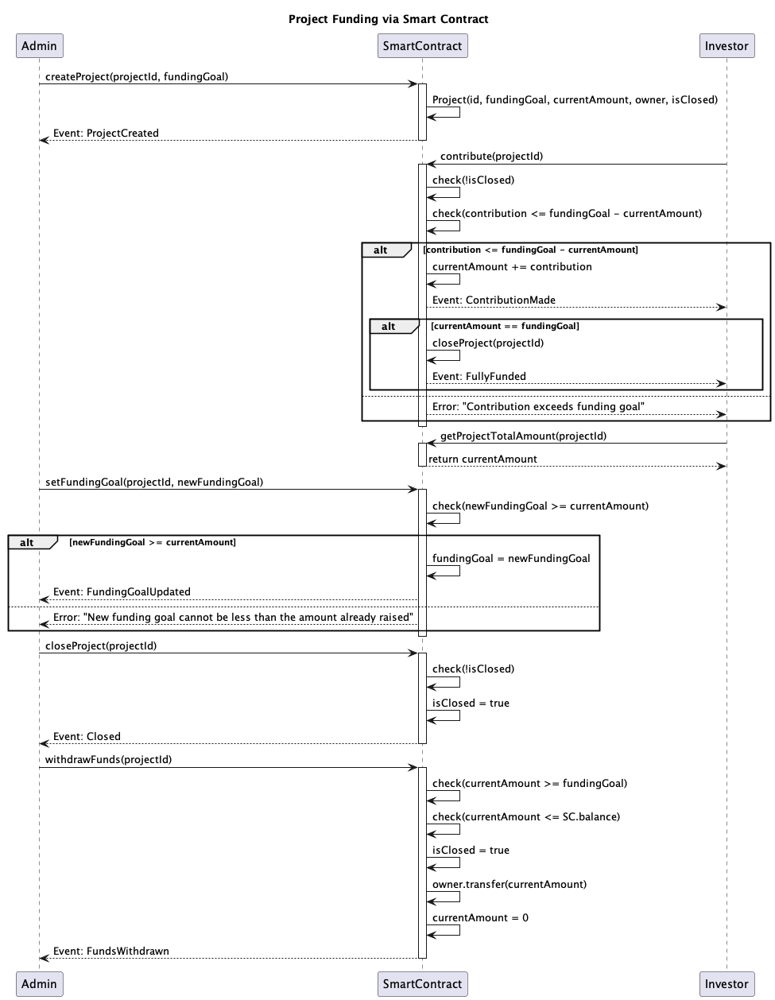

# Crowdfunding Smart Contract

This Ethereum smart contract is designed to facilitate the creation and funding of projects. Each project has a unique ID and a funding goal. Investors can contribute Ether to a project, and if the funding goal is reached, the project owner can withdraw the funds.

## Features

-   Create projects with a unique ID and a funding goal.
-   Contribute to projects. If the contribution exceeds the remaining amount to reach the funding goal, the transaction is reverted.
-   If the funding goal is reached, the project is automatically closed.
-   The project owner can manually close a project.
-   The project owner can update the funding goal. The new funding goal must be greater than or equal to the current amount raised.
-   Once the funding goal is reached, the project owner can withdraw the funds.

## Out of scope (for now)

-   Support for token contributions, including ERC20 stable coins.
-   Contract upgradeability using a proxy contract setup.
-   Role and permission-based access control.
-   Private sales and fee management.
-   Support for multi-chain deployment and interaction.
-   Transfer limits for contributions.
-   Retrieval functionality for all available projects.
-   KYC processes or similar steps.

## UML Diagram

Here is a UML sequence diagram of the smart contract:



## Events

The smart contract emits the following events:

-   **ProjectCreated**: Emitted when a new project is created.
-   **ContributionMade**: Emitted when a contribution is made to a project.
-   **FullyFunded**: Emitted when a project reaches its funding goal.
-   **Closed**: Emitted when a project is manually closed.
-   **FundingGoalUpdated**: Emitted when the funding goal of a project is updated.
-   **FundsWithdrawn**: Emitted when the project owner withdraws the funds.

## How to Use

First, install the dependencies:

```bash
npm install
```

Then, compile the smart contract:

```bash
npm run compile
```

To deploy the smart contract to the local Hardhat Network, run:

```bash
npm run deploy
```

You can also test the smart contract by running:

```bash
npm run test
```
